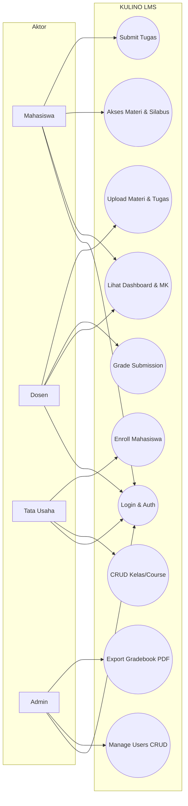
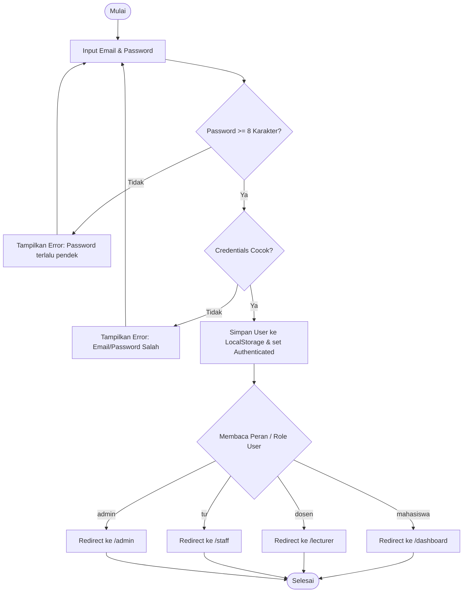
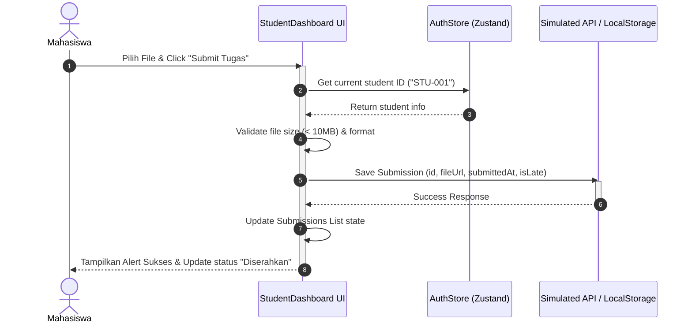
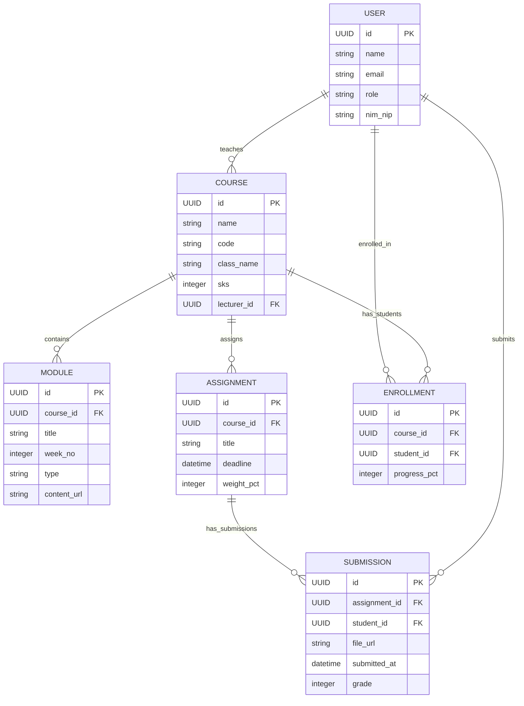

# Software Requirements Specification (SRS)

## KULINO — Spesifikasi Sistem & Arsitektur

**Versi:** 1.0 | **Tipe:** Technical Spec | **Stack:** Next.js + React + Tailwind

---

## 1. Technology Stack

### Frontend Framework

| Teknologi    | Versi           | Fungsi                  |
| ------------ | --------------- | ----------------------- |
| Next.js      | 14 (App Router) | Framework utama SSR/SSG |
| React        | 18              | UI component library    |
| TypeScript   | 5.x             | Type safety             |
| Tailwind CSS | v3              | Utility-first styling   |

### UI & Component Library

| Library             | Fungsi                          |
| ------------------- | ------------------------------- |
| ShadCN UI           | Pre-built accessible components |
| Radix UI Primitives | Headless UI primitives          |
| Lucide React        | Icon library                    |
| Framer Motion       | Animasi & transisi halaman      |

### State Management & Forms

| Library         | Fungsi                    |
| --------------- | ------------------------- |
| Zustand         | Global state management   |
| Context API     | Auth state (user session) |
| React Hook Form | Form handling             |
| Zod             | Schema validation         |

### Mock Data & Simulation

| Library                   | Fungsi                     |
| ------------------------- | -------------------------- |
| JSON Mock Files           | Static data source         |
| MSW (Mock Service Worker) | API mock layer             |
| Faker.js                  | Generate dummy data        |
| localStorage              | State persistence simulasi |

### Dev Tools & Deployment

| Tool              | Fungsi                    |
| ----------------- | ------------------------- |
| ESLint + Prettier | Code quality & formatting |
| Vercel            | Deployment platform       |
| GitHub            | Version control           |

---

## 2. Entity Relationship — Core Entities

### User

```
id            UUID          Primary key
name          string        Nama lengkap
email         string        Unique, login identifier
password_hash string        Bcrypt hashed
role          enum          guest|mahasiswa|dosen|tu|admin
nim_nip       string        Nullable, sesuai role
photo_url     string        Nullable
phone         string        Nullable
is_active     boolean       Default true
created_at    datetime
```

### Course

```
id            UUID
name          string        Nama mata kuliah
code          string        Kode MK (e.g. TI301)
class_name    string        e.g. TI-3A
semester      string        e.g. Ganjil 2025/2026
sks           integer
lecturer_id   UUID          FK → User (role: dosen)
description   text
status        enum          active|completed|archived
created_at    datetime
```

### Module

```
id            UUID
course_id     UUID          FK → Course
title         string
week_no       integer       1–14
type          enum          video|pdf|link|ppt
content_url   string
description   text          Nullable
is_published  boolean       Default false
created_at    datetime
```

### Assignment

```
id            UUID
course_id     UUID          FK → Course
title         string
description   text          Rich text (HTML)
deadline      datetime
weight_pct    integer       Persentase bobot (0–100)
allowed_formats string[]    e.g. ["pdf","docx","zip"]
max_size_mb   integer       Default 10
created_at    datetime
```

### Submission

```
id            UUID
assignment_id UUID          FK → Assignment
student_id    UUID          FK → User (role: mahasiswa)
file_url      string
submitted_at  datetime
is_late       boolean
version       integer       Default 1, max 3
grade         integer       Nullable, 0–100
feedback      text          Nullable
graded_at     datetime      Nullable
```

### Enrollment

```
id            UUID
course_id     UUID          FK → Course
student_id    UUID          FK → User
enrolled_at   datetime
status        enum          active|dropped|completed
progress_pct  integer       0–100
```

### Quiz

```
id            UUID
course_id     UUID          FK → Course
title         string
type          enum          quiz|uts|uas
duration_min  integer
open_at       datetime
close_at      datetime
is_published  boolean
```

### Notification

```
id            UUID
user_id       UUID          FK → User
type          enum          deadline|grade|discussion|admin|announcement
message       string
related_id    UUID          Nullable, ID entitas terkait
is_read       boolean       Default false
created_at    datetime
```

### Entitas Tambahan

| Entitas         | Relasi Utama                          |
| --------------- | ------------------------------------- |
| Question        | FK → Quiz                             |
| QuizAttempt     | FK → Quiz, User                       |
| Discussion      | FK → Course                           |
| DiscussionReply | FK → Discussion                       |
| Announcement    | FK → Course                           |
| Attendance      | FK → Course, User                     |
| Grade           | FK → Course, User (rekap nilai akhir) |
| CalendarEvent   | FK → Course (nullable)                |

---

## 3. Non-Functional Requirements

| Kategori      | Requirement                       | Target Metric         | Priority |
| ------------- | --------------------------------- | --------------------- | -------- |
| Performance   | First Contentful Paint (FCP)      | ≤ 1.5 detik           | P0       |
| Performance   | Largest Contentful Paint (LCP)    | ≤ 2.5 detik           | P0       |
| Performance   | Cumulative Layout Shift (CLS)     | < 0.1                 | P1       |
| Availability  | Uptime SLA (prototype, Vercel)    | 99% / bulan           | P1       |
| Usability     | Task completion rate (core flows) | ≥ 90% tanpa panduan   | P0       |
| Responsive    | Breakpoint mobile support         | 320px – 1440px        | P0       |
| Accessibility | WCAG compliance level             | AA minimum            | P1       |
| Security      | Route protection simulasi         | Redirect unauthorized | P0       |
| Security      | Input sanitization                | XSS prevention        | P0       |
| Scalability   | Data dummy volume support         | 1000+ records mock    | P2       |
| SEO           | Meta tags & Open Graph            | Landing page only     | P2       |

---

## 4. Route Architecture

### Public Routes (Accessible tanpa login)

```
/                   → Landing Page
/login              → Login Form
/register           → Register (Guest)
/courses            → Course Catalog (preview)
/demo               → Demo Preview
```

### Protected Routes (Memerlukan autentikasi)

```
/dashboard                    → Student Dashboard
/dashboard/course/[id]        → Course Detail (Student)
/dashboard/course/[id]/material/[mid]  → Material Viewer
/dashboard/course/[id]/assignment/[aid] → Assignment Detail
/dashboard/course/[id]/quiz/[qid]      → Quiz/Exam

/lecturer                     → Lecturer Dashboard
/lecturer/course/[id]         → Course Management
/lecturer/course/[id]/grade   → Grading Panel

/staff                        → TU Dashboard
/staff/courses                → Course Management
/staff/users                  → User Management

/admin                        → Admin Dashboard
/admin/users                  → Full User Management
/admin/reports                → Academic Reports
/admin/calendar               → Academic Calendar
```

---

## 5. System Diagrams (Overview)

### Use Case Diagram



### Activity Diagram (Key Flow: Login & Role-Based Redirect)



### Sequence Diagram (Key Flow: Submit Tugas)



### Entity Relationship Diagram (ERD)


