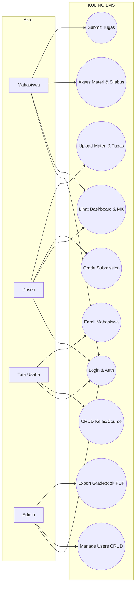
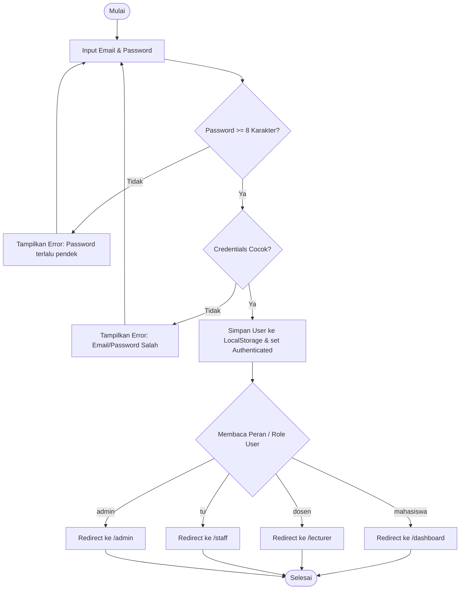
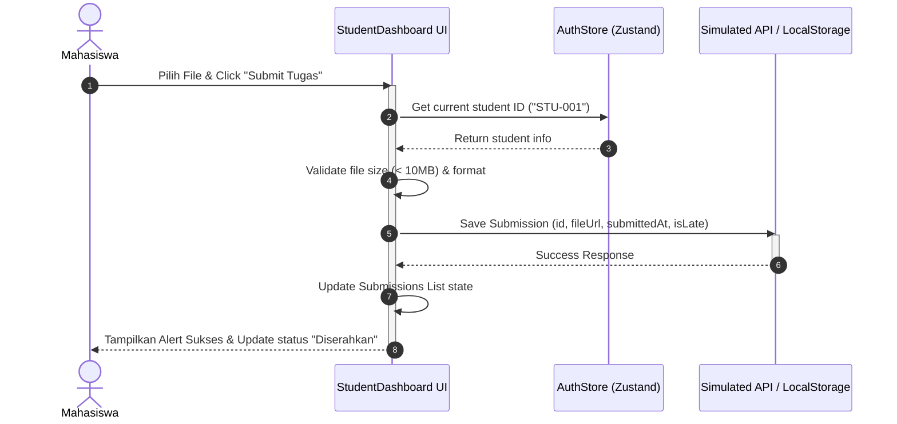
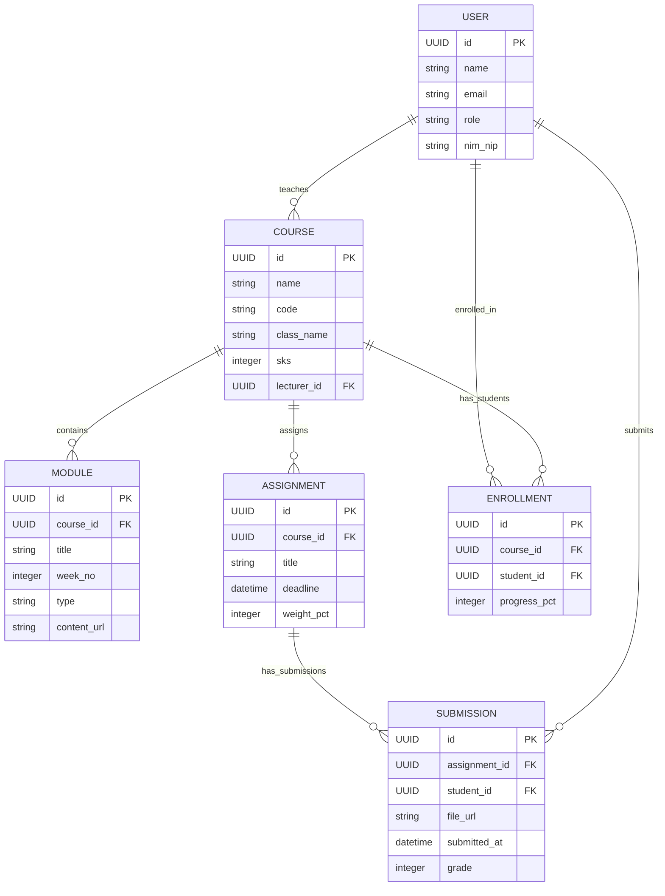

# Software Requirements Specification (SRS)

## KULINO — Spesifikasi Kebutuhan Perangkat Lunak

**Versi:** 1.0 | **Tipe:** System Specification | **Status:** Approved

---

## 1. System Overview & Boundaries

KULINO adalah platform LMS berbasis Next.js App Router. Sistem ini mencakup rute publik dan terproteksi untuk 5 aktor utama: Guest, Mahasiswa, Dosen, Staff TU, dan Admin.

```
+-----------------------------------------------------------------------+
|                             KULINO LMS                                |
|  +-------------------+  +-------------------+  +-------------------+  |
|  | Student Dashboard |  | Lecturer Dashboard|  | Staff / TU Panel  |  |
|  +-------------------+  +-------------------+  +-------------------+  |
|  +-----------------------------------------------------------------+  |
|  |                     Admin Control Panel                         |  |
|  +-----------------------------------------------------------------+  |
|  +-----------------------------------------------------------------+  |
|  |               Next.js Server Actions & Supabase BaaS             |  |
|  +-----------------------------------------------------------------+  |
+-----------------------------------------------------------------------+
```

---

## 2. Data Dictionary (Schema Definitions)

### User

```
id            UUID          Primary Key
name          string        NOT NULL
email         string        NOT NULL, UNIQUE
role          enum          guest|mahasiswa|dosen|tu|admin
nim_nip       string        NOT NULL, UNIQUE
avatar_url    string        Nullable
created_at    datetime      Default CURRENT_TIMESTAMP
```

### Course

```
id            UUID          Primary Key
name          string        NOT NULL
code          string        NOT NULL, UNIQUE
class_name    string        NOT NULL (e.g. "TI-3A")
semester      string        NOT NULL (e.g. "Ganjil 2025/2026")
sks           integer       NOT NULL, CHECK (sks > 0)
lecturer_id   UUID          FK → User
description   text          NOT NULL
created_at    datetime
```

### Module

```
id            UUID          Primary Key
course_id     UUID          FK → Course
title         string        NOT NULL
week_no       integer       NOT NULL, CHECK (1..16)
type          enum          video|pdf|link|ppt
content_url   string        NOT NULL
description   text          Nullable
is_published  boolean       Default true
```

### Assignment

```
id              UUID        Primary Key
course_id       UUID        FK → Course
title           string      NOT NULL
description     text        NOT NULL
deadline        datetime    NOT NULL
weight_pct      integer     NOT NULL, CHECK (1..100)
allowed_formats array       e.g. ["pdf", "docx", "zip"]
max_size_mb     integer     Default 10
```

### Submission

```
id            UUID          Primary Key
assignment_id UUID          FK → Assignment
student_id    UUID          FK → User
file_url      string        NOT NULL
submitted_at  datetime      Default CURRENT_TIMESTAMP
is_late       boolean       Default false
grade         integer       Nullable, CHECK (0..100)
feedback      text          Nullable
graded_at     datetime      Nullable
```

### Enrollment

```
id            UUID          Primary Key
course_id     UUID          FK → Course
student_id    UUID          FK → User
enrolled_at   datetime
status        enum          active|dropped|completed
progress_pct  integer       0–100  (computed: items_done / total_items × 100)
created_at    datetime
```

### Quiz

```
id            UUID          Primary Key
course_id     UUID          FK → Course
title         string        NOT NULL
type          enum          quiz|uts|uas
duration_min  integer       NOT NULL
open_at       datetime      NOT NULL
close_at      datetime      NOT NULL
is_published  boolean       Default false
```

### Notification

```
id            UUID          Primary Key
user_id       UUID          FK → User
type          enum          deadline|grade|discussion|admin|announcement
message       string        NOT NULL
related_id    UUID          Nullable, ID entitas terkait
is_read       boolean       Default false
created_at    datetime
```

### Question

```
id            UUID          Primary Key
quiz_id       UUID          FK → Quiz
content       text          Isi soal
type          enum          mcq|essay|true_false
options       jsonb         Nullable, pilihan jawaban (MCQ)
answer_key    text          Nullable, kunci jawaban (MCQ)
order_no      integer       Urutan tampil soal
```

### QuizAttempt

```
id            UUID          Primary Key
quiz_id       UUID          FK → Quiz
student_id    UUID          FK → User
started_at    datetime
submitted_at  datetime      Nullable
score         numeric(5,2)  Nullable, 0–100
answers       jsonb         Jawaban mahasiswa per soal
is_late       boolean       Default false
```

### Entitas Lain (Terdefinisi di DB Design)

| Entitas         | Relasi Utama                          | Status     |
| --------------- | ------------------------------------- | ---------- |
| Discussion      | FK → Course                           | ✅ Selesai |
| DiscussionReply | FK → Discussion                       | ✅ Selesai |
| Announcement    | FK → Course                           | ✅ Selesai |
| Attendance      | FK → Course, User                     | ✅ Selesai |
| Grade           | FK → Course, User (rekap nilai akhir) | ✅ Selesai |
| CalendarEvent   | FK → Course (nullable)                | ✅ Selesai |
| Quiz            | FK → Course                           | ✅ Selesai |
| Question        | FK → Quiz                             | ✅ Selesai |
| QuizAttempt     | FK → Quiz, User                       | ✅ Selesai |
| Notification    | FK → User                             | ✅ Selesai |

---

## 3. Non-Functional Requirements

| Kategori      | Requirement                       | Target Metric         | Priority |
| ------------- | --------------------------------- | --------------------- | -------- |
| Performance   | First Contentful Paint (FCP)      | ≤ 1.5 detik           | P0       |
| Performance   | Largest Contentful Paint (LCP)    | ≤ 2.5 detik           | P0       |
| Performance   | Cumulative Layout Shift (CLS)     | < 0.1                 | P1       |
| Availability  | Uptime SLA (prototype, Vercel)    | 99% / bulan           | P1       |
| Usability     | Task completion rate (core flows) | ≥ 90% tanpa panduan   | P0       |
| Responsive    | Breakpoint mobile support         | 320px – 1440px        | P0       |
| Accessibility | WCAG compliance level             | AA minimum            | P1       |
| Security      | Route protection simulasi         | Redirect unauthorized | P0       |
| Security      | Input sanitization                | XSS prevention        | P0       |
| Scalability   | Data dummy volume support         | 1000+ records mock    | P2       |
| SEO           | Meta tags & Open Graph            | Landing page only     | P2       |

---

## 4. Route Architecture

### Public Routes (Accessible tanpa login)

```
/                   → Landing Page
/login              → Login Form
/register           → Register (Guest)
/courses            → Course Catalog (preview)
/demo               → Demo Preview
```

### Protected Routes (Memerlukan autentikasi)

```
/dashboard                    → Student Dashboard
/dashboard/course/[id]        → Course Detail (Student)
/dashboard/course/[id]/material/[mid]  → Material Viewer
/dashboard/course/[id]/assignment/[aid] → Assignment Detail
/dashboard/course/[id]/quiz/[qid]      → Quiz/Exam

/lecturer                     → Lecturer Dashboard
/lecturer/course/[id]         → Course Management
/lecturer/course/[id]/grade   → Grading Panel

/staff                        → TU Dashboard
/staff/courses                → Course Management
/staff/users                  → User Management

/admin                        → Admin Dashboard
/admin/users                  → Full User Management
/admin/reports                → Academic Reports
/admin/calendar               → Academic Calendar
```

---

## 5. System Diagrams (Overview)

### Use Case Diagram



### Activity Diagram (Key Flow: Login & Role-Based Redirect)



### Sequence Diagram (Key Flow: Submit Tugas)



### Entity Relationship Diagram (ERD)


