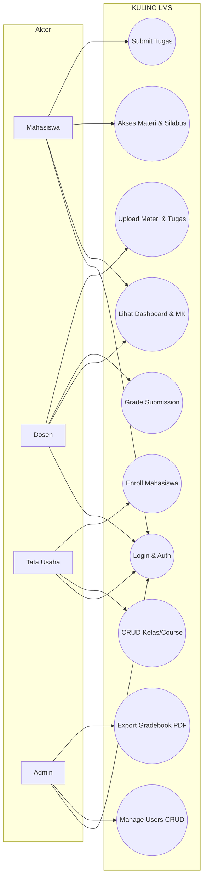
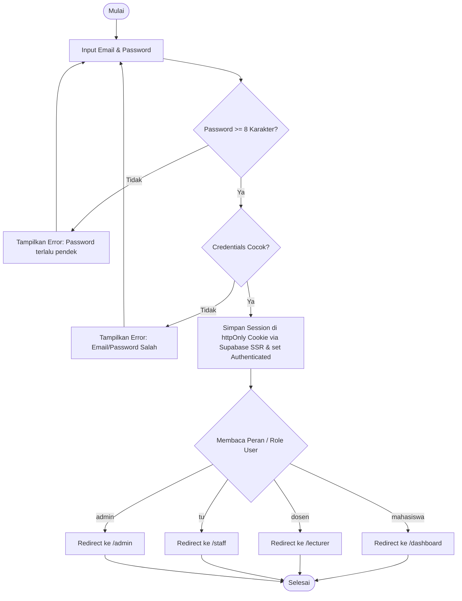
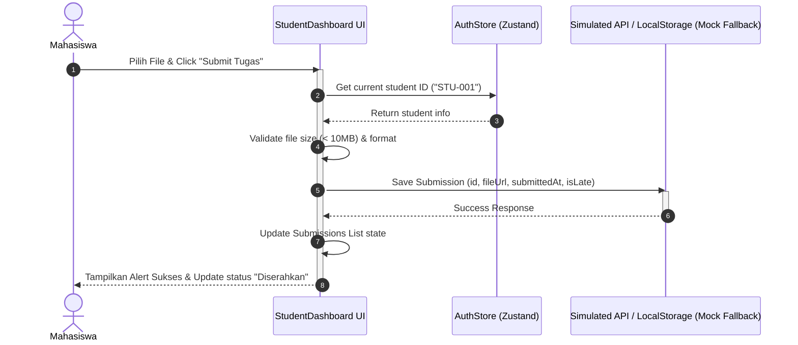

# Software Requirements Specification (SRS)

## KULINO — Spesifikasi Kebutuhan Perangkat Lunak

**Versi:** 1.2 | **Tipe:** System Specification | **Status:** Approved (Tersinkronisasi)

---

## 1. System Overview & Boundaries

KULINO adalah platform LMS berbasis Next.js App Router. Sistem ini mencakup rute publik dan terproteksi untuk 4 aktor ber-akun (Mahasiswa, Dosen, Staff TU, Admin) serta pengunjung anonim (tanpa login).

```
+-----------------------------------------------------------------------+
|                             KULINO LMS                                |
|  +-------------------+  +-------------------+  +-------------------+  |
|  | Student Dashboard |  | Lecturer Dashboard|  | Staff TU Panel   |  |
|  +-------------------+  +-------------------+  +-------------------+  |
|  +-----------------------------------------------------------------+  |
|  |                     Admin Control Panel                         |  |
|  +-----------------------------------------------------------------+  |
|  +-----------------------------------------------------------------+  |
|  |               Next.js Server Actions & Supabase BaaS             |  |
|  +-----------------------------------------------------------------+  |
+-----------------------------------------------------------------------+
```

---

## 2. Data Dictionary (Schema Definitions)

### User

```
id            UUID          Primary Key
name          string        NOT NULL
email         string        NOT NULL, UNIQUE
role          enum          mahasiswa|dosen|tu|admin, Default 'mahasiswa'
nim_nip       string        NOT NULL, UNIQUE
avatar_url    string        Nullable
created_at    datetime      Default CURRENT_TIMESTAMP
```

> Catatan: Pengunjung anonim (tanpa login) **bukan** record pada tabel `users`. Registrasi akun baru menghasilkan role default `mahasiswa`; perubahan role dilakukan oleh TU/Admin.

### Course (Master Data Mata Kuliah)

```
id            UUID          Primary Key
name          string        NOT NULL
code          string        NOT NULL, UNIQUE
kelompok_mk   string        NOT NULL, Default "Wajib Program Studi"
sks           integer       NOT NULL, CHECK (sks > 0)
teori         integer       NOT NULL, Default 0
praktek       integer       NOT NULL, Default 0
kurikulum_id  UUID          FK → Kurikulum
description   text          NOT NULL
created_at    datetime
```

> Catatan: `courses` adalah master data mata kuliah. Satu course dapat memiliki banyak kelas aktif per semester.

### Class (Kelas Aktif / Penawaran Mata Kuliah)

```
id            UUID          Primary Key
course_id     UUID          FK → Course
class_name    string        NOT NULL (e.g. "TI-3A")
semester      string        NOT NULL (e.g. "Ganjil 2025/2026")
lecturer_id   UUID          FK → User
day_of_week   string        Nullable (e.g. "Senin")
start_time    time          Nullable
end_time      time          Nullable
room          string        Nullable
status        enum          active|completed
created_at    datetime
```

> Catatan: Kombinasi `(course_id, class_name, semester)` unik (UNIQUE). Seluruh entitas operasional (Module, Assessment, Enrollment, dsb.) mereferensikan `class_id`.

### Module

```
id            UUID          Primary Key
class_id      UUID          FK → Class
title         string        NOT NULL
week_no       integer       NOT NULL, CHECK (1..16)
type          enum          video|pdf|link|ppt
content_url   string        NOT NULL
description   text          Nullable
is_published  boolean       Default true
```

### Assessment (Penilaian: Tugas / UTS / UAS)

```
id              UUID        Primary Key
class_id        UUID        FK → Class
title           string      NOT NULL
description     text        NOT NULL
type            enum        task|uts|uas
mode            enum        file_upload|online_quiz|manual
weight_pct      integer     NOT NULL, CHECK (1..100)
open_at         datetime    Nullable (window mulai; utk uts/uas wajib)
deadline        datetime    NOT NULL (batas akhir; utk online = close_at)
duration_min    integer     Nullable, CHECK (>0)  (hanya mode online_quiz)
allowed_formats array       Nullable, e.g. ["pdf", "docx", "zip"] (hanya mode file_upload)
max_size_mb     integer     Nullable, Default 10 (hanya mode file_upload)
is_published    boolean     Default false
created_at      datetime
```

> Catatan: Model penilaian fleksibel — UTS/UAS dapat berupa file upload, online quiz, atau manual; tugas pun dapat berupa quiz online. Kombinasi `type` + `mode` bebas sesuai dosen.

### Submission

```
id            UUID          Primary Key
assessment_id UUID          FK → Assessment
student_id    UUID          FK → User
file_url      string        NOT NULL (mode file_upload)
submitted_at  datetime      Default CURRENT_TIMESTAMP
is_late       boolean       Default false
status        enum          Nullable, graded|revision_requested
grade         integer       Nullable, CHECK (0..100)
feedback      text          Nullable
graded_at     datetime      Nullable
```

### Enrollment

```
id            UUID          Primary Key
class_id      UUID          FK → Class
student_id    UUID          FK → User
status        enum          active|dropped|completed
progress_pct  integer       0–100  (computed: items_done / total_items × 100)
created_at    datetime
```

> Catatan: Kombinasi `(student_id, class_id)` unik (UNIQUE).

### Question

```
id            UUID          Primary Key
assessment_id UUID          FK → Assessment
content       text          Isi soal
type          enum          mcq|essay|true_false
options       jsonb         Nullable, pilihan jawaban (MCQ)
answer_key    text          Nullable, kunci jawaban (MCQ)
order_no      integer       Urutan tampil soal
```

> Catatan: Hanya relevan untuk Assessment dengan `mode = online_quiz`.

### AssessmentAttempt

```
id            UUID          Primary Key
assessment_id UUID          FK → Assessment
student_id    UUID          FK → User
started_at    datetime
submitted_at  datetime      Nullable
score         numeric(5,2)  Nullable, 0–100
answers       jsonb         Jawaban mahasiswa per soal
is_late       boolean       Default false
```

> Catatan: Untuk Assessment bertipe `uts`/`uas`, kombinasi `(assessment_id, student_id)` unik (UNIQUE) — **one-time attempt**.

### Notification

```
id            UUID          Primary Key
user_id       UUID          FK → User
type          enum          deadline|grade|discussion|admin|announcement
message       string        NOT NULL
related_id    UUID          Nullable, ID entitas terkait
is_read       boolean       Default false
created_at    datetime
```

### AuditLog

```
id            UUID          Primary Key
user_name     string        NOT NULL (operator yang melakukan aksi)
action        text          NOT NULL (misal: "Login", "Membuat user baru")
ip_address    string        Nullable
created_at    datetime      Default CURRENT_TIMESTAMP
```

> Catatan: Diisi otomatis oleh trigger DB (`trg_user_audit`, `trg_user_login`) — merepresentasikan BR-10. Rincian lihat `12_security.md` §7.

### Entitas Lain (Terdefinisi di DB Design)

| Entitas         | Relasi Utama                          | Status     |
| --------------- | ------------------------------------- | ---------- |
| Discussion      | FK → Class                            | ✅ Selesai |
| DiscussionReply | FK → Discussion                       | ✅ Selesai |
| Announcement    | FK → Class                            | ✅ Selesai |
| Attendance      | FK → Class, User                      | ✅ Selesai |
| Grade           | FK → Class, User (rekap nilai akhir)  | ✅ Selesai |
| CalendarEvent   | FK → Class (nullable)                 | ✅ Selesai |
| Assessment      | FK → Class                            | ✅ Selesai |
| Question        | FK → Assessment                       | ✅ Selesai |
| AssessmentAttempt | FK → Assessment, User              | ✅ Selesai |
| Notification    | FK → User                             | ✅ Selesai |
| AuditLog        | System-generated (trigger DB)         | ✅ Selesai |

---

## 3. Non-Functional Requirements

| Kategori      | Requirement                       | Target Metric         | Priority |
| ------------- | --------------------------------- | --------------------- | -------- |
| Performance   | First Contentful Paint (FCP)      | ≤ 1.5 detik           | P0       |
| Performance   | Largest Contentful Paint (LCP)    | ≤ 2.5 detik           | P0       |
| Performance   | Cumulative Layout Shift (CLS)     | < 0.1                 | P1       |
| Availability  | Uptime SLA (prototype, Vercel)    | 99% / bulan           | P1       |
| Usability     | Task completion rate (core flows) | ≥ 90% tanpa panduan   | P0       |
| Responsive    | Breakpoint mobile support         | 320px – 1440px        | P0       |
| Accessibility | WCAG compliance level             | AA minimum            | P1       |
| Security      | Route protection simulasi         | Redirect unauthorized | P0       |
| Security      | Input sanitization                | XSS prevention        | P0       |
| Scalability   | Data dummy volume support         | 1000+ records mock    | P2       |
| SEO           | Meta tags & Open Graph            | Landing page only     | P2       |

---

## 4. Route Architecture

### Public Routes (Accessible tanpa login)

```
/                   → Landing Page
/login              → Login Form
/register           → Register (akun baru, role default mahasiswa)
/courses            → Course Catalog (preview)
/demo               → Demo Preview
```

### Protected Routes (Memerlukan autentikasi)

```
/dashboard                    → Student Dashboard
/dashboard/course/[id]        → Course Detail (Student)
/dashboard/course/[id]/material/[mid]  → Material Viewer
/dashboard/course/[id]/assessment/[aid]             → Assessment Detail (upload / online quiz / info)
/dashboard/course/[id]/assessment/[aid]/attempt     → Pengerjaan Online (mode online_quiz)

/lecturer                     → Lecturer Dashboard
/lecturer/course/[id]         → Course Management
/lecturer/course/[id]/grade   → Grading Panel

/staff                        → TU Dashboard
/staff/courses                → Course Management
/staff/users                  → User Management

/admin                        → Admin Dashboard
/admin/users                  → Full User Management
/admin/reports                → Academic Reports
/admin/calendar               → Academic Calendar
```

---

## 5. System Diagrams (Overview)

### Use Case Diagram



### Activity Diagram (Key Flow: Login & Role-Based Redirect)



### Sequence Diagram (Key Flow: Submit Tugas)

> *Diagram ini menggambarkan **mode mock / offline fallback** (`05_architecture.md` §6.1). Pada mode produksi, session tersimpan di httpOnly cookie via `@supabase/ssr`; localStorage hanya dipakai saat koneksi ke Supabase terputus.*



### Entity Relationship Diagram (ERD)

Diagram berikut mencakup **seluruh 20 entitas** sesuai `06_database.md` §2 (Kamus Data).

```mermaid
erDiagram
    PRODI {
        UUID id PK
        string code
        string name
        string degree
    }
    KURIKULUM {
        UUID id PK
        UUID prodi_id FK
        string name
        integer year
        boolean is_active
    }
    USER {
        UUID id PK
        string name
        string email
        string role
        string nim_nip
        UUID prodi_id FK
    }
    COURSE {
        UUID id PK
        string name
        string code
        integer sks
        UUID kurikulum_id FK
        string description
    }
    CLASS {
        UUID id PK
        UUID course_id FK
        string class_name
        string semester
        UUID lecturer_id FK
        string day_of_week
        time start_time
        time end_time
        string room
        string status
    }
    ENROLLMENT {
        UUID id PK
        UUID class_id FK
        UUID student_id FK
        string status
        integer progress_pct
    }
    MODULE {
        UUID id PK
        UUID class_id FK
        string title
        integer week_no
        string type
        string content_url
    }
    ASSESSMENT {
        UUID id PK
        UUID class_id FK
        string title
        string type
        string mode
        integer weight_pct
        datetime open_at
        datetime deadline
        integer duration_min
    }
    SUBMISSION {
        UUID id PK
        UUID assessment_id FK
        UUID student_id FK
        string file_url
        datetime submitted_at
        string status
        integer grade
    }
    ANNOUNCEMENT {
        UUID id PK
        UUID class_id FK
        string title
        text content
    }
    DISCUSSION {
        UUID id PK
        UUID class_id FK
        UUID author_id FK
        string title
        text content
    }
    DISCUSSION_REPLY {
        UUID id PK
        UUID discussion_id FK
        UUID author_id FK
        text content
    }
    ATTENDANCE {
        UUID id PK
        UUID class_id FK
        UUID student_id FK
        integer week_no
        string status
    }
    GRADE {
        UUID id PK
        UUID class_id FK
        UUID student_id FK
        numeric assignment_score
        numeric midterm_score
        numeric final_score
        numeric participation_score
        string final_grade_letter
    }
    CALENDAR_EVENT {
        UUID id PK
        string title
        datetime date
        string type
        UUID class_id FK
    }
    QUESTION {
        UUID id PK
        UUID assessment_id FK
        text content
        string type
        integer order_no
    }
    QUESTION_OPTION {
        UUID id PK
        UUID question_id FK
        text option_text
        boolean is_correct
    }
    ATTEMPT {
        UUID id PK
        UUID assessment_id FK
        UUID student_id FK
        datetime started_at
        datetime submitted_at
        numeric score
        jsonb answers
    }
    NOTIFICATION {
        UUID id PK
        UUID user_id FK
        string type
        string message
        UUID related_id
        boolean is_read
    }
    AUDITLOG {
        UUID id PK
        string user_name
        text action
        string ip_address
    }

    PRODI ||--o{ KURIKULUM : "has"
    PRODI ||--o{ USER : "has"
    KURIKULUM ||--o{ COURSE : "owns"
    COURSE ||--o{ CLASS : "offers"
    USER ||--o{ CLASS : "teaches"
    CLASS ||--o{ ENROLLMENT : "has_students"
    USER ||--o{ ENROLLMENT : "enrolled_in"
    CLASS ||--o{ MODULE : "contains"
    CLASS ||--o{ ASSESSMENT : "assigns"
    ASSESSMENT ||--o{ SUBMISSION : "has_submissions"
    USER ||--o{ SUBMISSION : "submits"
    CLASS ||--o{ ANNOUNCEMENT : "broadcasts"
    CLASS ||--o{ DISCUSSION : "has"
    USER ||--o{ DISCUSSION : "authors"
    DISCUSSION ||--o{ DISCUSSION_REPLY : "has_replies"
    USER ||--o{ DISCUSSION_REPLY : "replies"
    CLASS ||--o{ ATTENDANCE : "records"
    USER ||--o{ ATTENDANCE : "attends"
    CLASS ||--o{ GRADE : "grades"
    USER ||--o{ GRADE : "receives"
    CLASS ||--o{ CALENDAR_EVENT : "schedules"
    ASSESSMENT ||--o{ QUESTION : "contains"
    QUESTION ||--o{ QUESTION_OPTION : "has_options"
    ASSESSMENT ||--o{ ATTEMPT : "attempted_by"
    USER ||--o{ ATTEMPT : "attempts"
    USER ||--o{ NOTIFICATION : "receives"
```

> Catatan: `AUDITLOG` diisi otomatis oleh trigger DB (BR-10) tanpa FK langsung ke entitas lain — lihat `12_security.md` §7.
