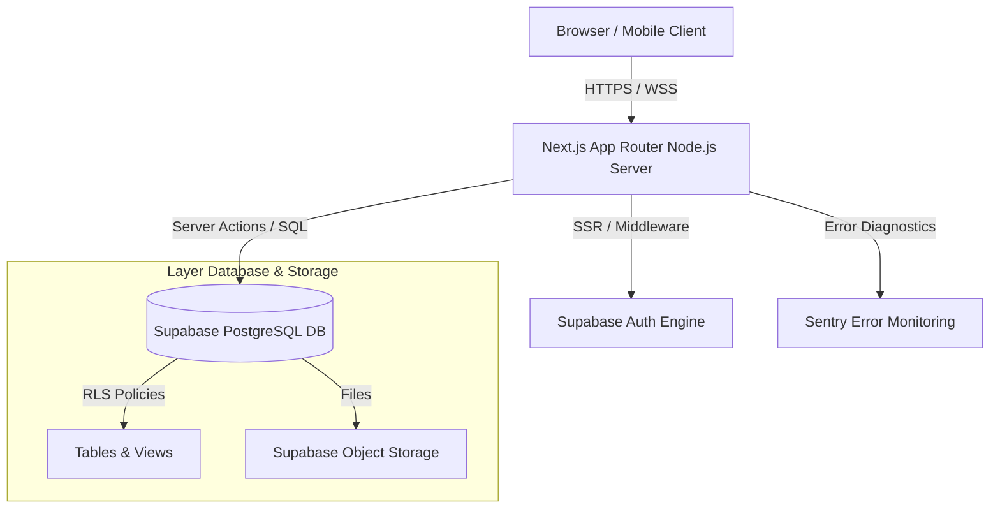

# Dokumen Arsitektur Sistem (System Architecture Specification)

**Sistem:** KULINO — Kuliah Online | Learning Management System  
**Versi Dokumen:** 1.1  
**Status:** Terverifikasi & Siap Produksi

Dokumen ini mendeskripsikan arsitektur tingkat tinggi (*high-level architecture*), tumpukan teknologi (*tech stack*), arsitektur performa, skalabilitas, serta ketahanan aplikasi (*resilience & fault tolerance*) KULINO LMS.

---

## 1. Arsitektur Tingkat Tinggi (High-Level Architecture)

KULINO LMS dibangun dengan arsitektur **Hybrid Jamstack & Serverless** menggunakan Next.js App Router (React 19) di lapisan depan dan Supabase BaaS (PostgreSQL + Auth + Storage) di lapisan belakang.



---

## 2. Tech Stack & Dependensi Utama

| Lapisan | Teknologi | Versi | Keterangan |
| :--- | :--- | :--- | :--- |
| **Frontend Core** | Next.js (App Router) | 16.x | SSR, SSG, Server Actions, Standalone Build |
| **UI Library** | React | 19.2.4 | Concurrent Mode, Server Components |
| **Styling** | Tailwind CSS | v4.0 | Utility-first CSS-first architecture |
| **State Management** | Zustand | v5.0 | Global Auth & transient UI states |
| **Form & Validation** | React Hook Form & Zod | v7 / v4 | Client & Server Schema Validation |
| **Backend & DB** | Supabase (@supabase/ssr) | ^0.10.3 | PostgreSQL, Auth, Row Level Security |
| **Containerization** | Docker & Docker Compose | Node 20 Alpine | Multi-stage production container |
| **CI/CD** | GitHub Actions | Workflows v4 | Automated Lint, Test & Docker Verification |

---

## 3. Optimasi Database & Performa Kueri (Performance Architecture)

Database PostgreSQL pada Supabase dirancang untuk menangani beban konkurensi tinggi melalui beberapa strategi:

### 3.1 Indeks pada Kunci Asing & Kolom Kunci (Foreign Key Indexing)
- `idx_users_role` & `idx_users_prodi_id` pada tabel `users`.
- `idx_classes_course_id` & `idx_classes_lecturer_id` pada tabel `classes`.
- `idx_enrollments_student_id` & `idx_enrollments_class_id` pada tabel `enrollments`.
- `idx_modules_class_id` pada tabel `modules`.
- `idx_assignments_class_id` pada tabel `assignments`.
- `idx_submissions_assignment_id` & `idx_submissions_student_id` pada tabel `submissions`.
- `idx_announcements_class_id` pada tabel `announcements`.
- `idx_attendance_student_id` pada tabel `attendance`.
- `idx_calendar_events_class_id` pada tabel `calendar_events`.

### 3.2 Indeks Gabungan & Parsial
- `idx_attendance_class_student` (`class_id`, `student_id`) pada tabel `attendance`.
- `idx_grades_student_class` (`student_id`, `class_id`) pada tabel `grades`.
- `idx_notifications_unread` (`user_id`, `is_read`) dengan klausul `WHERE is_read = false`.

### 3.3 Optimasi Kueri RLS via InitPlan Caching
Fungsi `auth.uid()` atau `auth.role()` pada RLS kebijakan dibungkus di dalam subquery `(SELECT auth.uid())` sehingga dievaluasi hanya satu kali per eksekusi query (InitPlan).

---

## 4. Pencegahan Kueri N+1 (N+1 Query Prevention)

KULINO LMS menggunakan Supabase SDK yang berbasis PostgREST untuk menerjemahkan permintaan bertingkat (*nested queries*) menjadi satu kueri SQL dengan JOIN yang efisien di sisi server PostgreSQL.

```ts
const { data: enrolls } = await supabase
    .from('enrollments')
    .select(`
      class_id,
      classes (
        id,
        class_name,
        semester,
        status,
        courses ( id, name, code, sks ),
        users ( name )
      )
    `)
    .eq('student_id', authUser.id);
```

---

## 5. Strategi Caching & Background Jobs

1. **Request Memoization**: Caching otomatis permintaan `fetch` dalam satu siklus render server.
2. **Full Route Cache**: Halaman statis (seperti `/` dan `/demo`) di-cache pada build time.
3. **Revalidasi On-Demand**: Menggunakan `revalidatePath()` saat data diperbarui oleh dosen atau admin.
4. **Bulk Import Chunking**: Registrasi massal mahasiswa via CSV dikirim secara berurutan (*batching*) dengan visual progress bar.

---

## 6. Keandalan & Ketahanan Aplikasi (Reliability & Resilience)

### 6.1 Arsitektur Mode Ganda (Dual-Mode Fallback)
Ketika koneksi ke Supabase terputus, aplikasi secara otomatis beralih ke **Mode Mock** (local state Zustand & static json data), mencegah crash layar putih (*white screen of death*).

### 6.2 Next.js Error Boundaries
- **Segment Error Boundary (`app/error.tsx`)**: Menangkap error lokal segmen halaman dengan tombol retry berbasis `unstable_retry`.
- **Root Error Boundary (`app/global-error.tsx`)**: Menangkap crash fatal di tingkat root layout dengan tag `<html>` & `<body>` tersendiri.

### 6.3 Centralized Error Handling (`lib/errors.ts` & `lib/api-error-handler.ts`)
- Custom error classes: `AppError`, `NotFoundError`, `UnauthorizedError`, `ForbiddenError`, `ValidationError`, `ConfigurationError`.
- Penyamaran stack trace di produksi: API route handler (`withErrorHandler`) menyembunyikan detail internal database dan hanya mengembalikan pesan aman generic.
