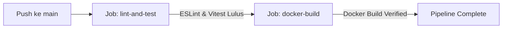

# Dokumen Deployment & CI/CD Pipeline (Deployment Specification)

**Sistem:** KULINO — Kuliah Online | Learning Management System  
**Versi Dokumen:** 1.1  
**Status:** Terverifikasi & Siap Produksi

Dokumen ini mendeskripsikan konfigurasi *Containerization* (Docker), pengorkestrasian lokal/produksi, pengaturan variabel lingkungan (`.env`), serta pipeline otomatisasi CI/CD GitHub Actions.

---

## 1. Konfigurasi Variabel Lingkungan (`.env.local`)

Buat berkas `.env.local` berdasarkan berkas `.env.local.example`:

```bash
# Supabase Credentials (Wajib untuk Mode Live Database)
NEXT_PUBLIC_SUPABASE_URL=https://<project-id>.supabase.co
NEXT_PUBLIC_SUPABASE_ANON_KEY=eyJhbGciOiJIUzI1NiIsInR5cCI6IkpXVCJ9...
SUPABASE_SERVICE_ROLE_KEY=eyJhbGciOiJIUzI1NiIsInR5cCI6IkpXVCJ9...

# Sentry Error Monitoring (Opsional)
NEXT_PUBLIC_SENTRY_DSN=https://examplePublicKey@o0.ingest.sentry.io/0
SENTRY_ORG=udinus
SENTRY_PROJECT=kulino-lms
```

---

## 2. Containerization dengan Docker

### 2.1 Multi-Stage Dockerfile (`Dockerfile`)
Menggunakan image dasar `node:20-alpine` dengan 3 tahapan build untuk meminimalkan ukuran image:
1. `deps`: Install dependensi via `npm ci`.
2. `builder`: Kompilasi aplikasi Next.js dengan `output: 'standalone'`.
3. `runner`: Image minimalis berbasis user non-root `nextjs` mengekspos port `3000`.

```dockerfile
FROM node:20-alpine AS deps
RUN apk add --no-libc-compat
WORKDIR /app
COPY package.json package-lock.json ./
RUN npm ci

FROM node:20-alpine AS builder
WORKDIR /app
COPY --from=deps /app/node_modules ./node_modules
COPY . .
ENV NEXT_TELEMETRY_DISABLED 1
RUN npm run build

FROM node:20-alpine AS runner
WORKDIR /app
ENV NODE_ENV production
ENV PORT 3000
ENV HOSTNAME "0.0.0.0"

RUN addgroup --system --gid 1001 nodejs
RUN adduser --system --uid 1001 nextjs

COPY --from=builder /app/public ./public
COPY --from=builder --chown=nextjs:nodejs /app/.next/standalone ./
COPY --from=builder --chown=nextjs:nodejs /app/.next/static ./.next/static

USER nextjs
EXPOSE 3000
CMD ["node", "server.js"]
```

```bash
# Build Docker image secara manual
docker build -t lms-web .

# Menjalankan container Docker
docker run -p 3000:3000 --env-file .env.local lms-web
```

### 2.2 Docker Compose (`docker-compose.yml`)
Untuk mengorkestrasikan service `lms-web` secara lokal maupun di server produksi:

```yaml
version: '3.8'

services:
  lms-web:
    build:
      context: .
      dockerfile: Dockerfile
    container_name: kulino-lms-web
    restart: always
    ports:
      - '3000:3000'
    env_file:
      - .env.local
    healthcheck:
      test: ['CMD', 'wget', '--no-verbose', '--tries=1', '--spider', 'http://localhost:3000/api/health']
      interval: 30s
      timeout: 10s
      retries: 3
```

```bash
# Jalankan container di background
docker compose up -d --build

# Hentikan container
docker compose down
```

---

## 3. Otomatisasi CI/CD Pipeline (GitHub Actions)

Berkas `.github/workflows/ci-cd.yml` mengatur pipeline integrasi berkelanjutan yang dipicu otomatis saat `push` atau `pull_request` ke cabang `main` / `master`:

```yaml
name: CI/CD Pipeline

on:
  push:
    branches: [ main, master ]
  pull_request:
    branches: [ main, master ]

jobs:
  lint-and-test:
    runs-on: ubuntu-latest
    steps:
      - uses: actions/checkout@v4
      - name: Use Node.js 20
        uses: actions/setup-node@v4
        with:
          node-version: 20
          cache: 'npm'
      - name: Install dependencies
        run: npm ci
      - name: Run Linter
        run: npm run lint
      - name: Run Vitest Unit Tests
        run: npm run test
      - name: Verify Next.js Build
        run: npm run build

  docker-build:
    runs-on: ubuntu-latest
    needs: lint-and-test
    steps:
      - uses: actions/checkout@v4
      - name: Set up Docker Buildx
        uses: docker/setup-buildx-action@v3
      - name: Build Docker Image
        uses: docker/build-push-action@v5
        with:
          context: .
          push: false
          tags: kulino-lms:test
```



- **Job `lint-and-test`**: Node.js 20, npm cache, `npm ci`, `npm run lint`, `npm run test`, `npm run build`.
- **Job `docker-build`**: Set up Docker Buildx, menguji kompilasi `Dockerfile` tanpa push registry.

---

## 4. Panduan Server Deployment (Production Server Setup)

### 4.1 Persyaratan Server (Minimum System Requirements)
- **OS**: Ubuntu 22.04 LTS / Debian 12 / AlmaLinux 9
- **CPU**: 2 vCPU
- **RAM**: 4 GB RAM
- **Disk**: 20 GB SSD Storage
- **Prasyarat**: Docker v24+ & Docker Compose v2+

### 4.2 Langkah-Langkah Deployment Pertama Kali
1. Clone repositori ke server produksi:
   ```bash
   git clone https://github.com/Alfaturachman/kulino-lms.git /opt/kulino-lms
   cd /opt/kulino-lms
   ```
2. Buat berkas variabel lingkungan `.env.local` dan isi credentials Supabase produksi:
   ```bash
   nano .env.local
   ```
3. Jualankan container dengan Docker Compose:
   ```bash
   docker compose up -d --build
   ```
4. Verifikasi status kesehatan container:
   ```bash
   curl http://localhost:3000/api/health
   ```

### 4.3 Konfigurasi Reverse Proxy (Nginx + SSL Certbot)
Untuk mengekspos aplikasi ke domain publik secara aman dengan HTTPS:

```nginx
server {
    server_name kulino.dinus.ac.id;

    location / {
        proxy_pass http://127.0.0.1:3000;
        proxy_http_version 1.1;
        proxy_set_header Upgrade $http_upgrade;
        proxy_set_header Connection 'upgrade';
        proxy_set_header Host $host;
        proxy_cache_bypass $http_upgrade;
        proxy_set_header X-Real-IP $remote_addr;
        proxy_set_header X-Forwarded-For $proxy_add_x_forwarded_for;
        proxy_set_header X-Forwarded-Proto $scheme;
    }
}
```

```bash
# Install SSL certificate gratis via Let's Encrypt
sudo certbot --nginx -d kulino.dinus.ac.id
```
