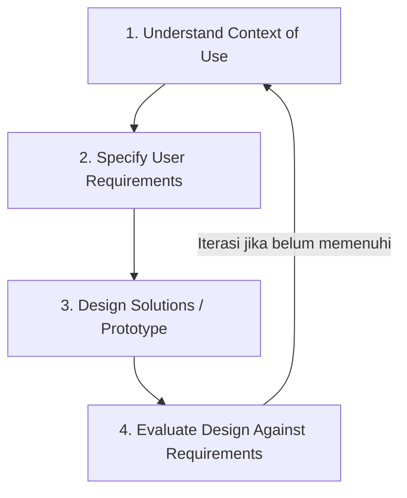

# Catatan Keputusan Arsitektur & Landasan Riset (Decision Log & ADR)

**Sistem:** KULINO — Kuliah Online | Learning Management System  
**Versi Dokumen:** 1.1  
**Status:** Terverifikasi & Siap Produksi

Dokumen ini mendokumentasikan Architectural Decision Records (ADR), alasan pemilihan teknologi, *trade-off* teknis, serta draf kerangka jurnal ilmiah pengembangan KULINO LMS.

---

## 1. Architectural Decision Records (ADR)

### ADR-01: Pemilihan Framework Next.js App Router (React 19)
- **Status**: Accepted (Disetujui)
- **Konteks**: Pengembangan antarmuka LMS membutuhkan performa muat awal yang cepat, penanganan SEO dasar pada landing page, serta integrasi yang aman dengan database tanpa mengekspos kredensial rahasia ke browser client.
- **Keputusan**: Menggunakan Next.js 16 App Router dibanding Pages Router atau Single Page Application (SPA) React murni.
- **Konsekuensi & Trade-off**:
  - *Positif*: Mendukung Server-Side Rendering (SSR) untuk data pre-fetching instan, Server Actions untuk pengubahan data terproteksi di server, dan kompilasi Docker standalone build `output: 'standalone'`.
  - *Negatif*: Memerlukan pemisahan arsitektur yang ketat antara Server Components (data fetchers) dan Client Components (UI interactors).

### ADR-02: Backend-as-a-Service (BaaS) Supabase
- **Status**: Accepted (Disetujui)
- **Konteks**: Diperlukan infrastruktur database relasional yang kuat untuk menyimpan integritas data akademik (users, courses, classes, enrollments, grades) sekaligus fitur otentikasi JWT dan penyimpanan file objek.
- **Keputusan**: Menggunakan Supabase (PostgreSQL + Auth + Storage) dibanding membangun backend REST API mandiri (Express/NestJS) dari awal.
- **Konsekuensi & Trade-off**:
  - *Positif*: Mempercepat pengembangan dengan ketersediaan fitur otentikasi instan, Row Level Security (RLS) di tingkat database, auto-generated PostgREST APIs, dan Supabase Storage.
  - *Negatif*: Terikat pada ekosistem Supabase, namun schema database PostgreSQL murni memudahkan migrasi jika diperlukan di masa depan.

### ADR-03: Dual-Mode Fallback System (Supabase vs Local Mock)
- **Status**: Accepted (Disetujui)
- **Konteks**: Aplikasi harus dapat diuji dan didemonstrasikan dalam kondisi offline atau saat jaringan cloud database Supabase mengalami gangguan.
- **Keputusan**: Menerapkan arsitektur fallback dual-mode pada store otentikasi (Zustand) dan komponen dashboard.
- **Konsekuensi & Trade-off**:
  - *Positif*: Menjamin aplikasi dapat diuji secara mandiri (misal: saat demo offline atau CI/CD tanpa koneksi jaringan Supabase) tanpa mengalami crash layar putih (*white screen of death*).
  - *Negatif*: Memerlukan logika pengondisian tambahan pada store dan handler UI.

---

## 2. Kerangka Riset Jurnal Ilmiah (LMS Journal Framework)

### Informasi Usulan Artikel
- **Target Publikasi**: Jurnal Nasional Terakreditasi SINTA (2/3/4) bidang Sistem Informasi/Teknologi Informasi, atau Prosiding Konferensi Nasional (SENTIKA, SEMNAS TEKNOMEDIA).
- **Bidang Penelitian**: *Human-Computer Interaction (HCI)* / Rekayasa Perangkat Lunak (*Software Engineering*).
- **Metode Pendekatan**: *User-Centered Design (UCD)* / *Object-Oriented Analysis and Design (OOAD)*.

### Pilihan Judul:
1. **"Modernisasi Antarmuka dan Evaluasi Usabilitas KULINO LMS Universitas Dian Nuswantoro Menggunakan Pendekatan User-Centered Design"**
2. **"Rancang Bangun Prototipe LMS KULINO dengan Arsitektur Hybrid dan Optimasi Database Kueri Row-Level Security"**

### Draf Abstrak (Draft Abstract)

> **Abstrak** — *Sistem Manajemen Pembelajaran (LMS) KULINO Universitas Dian Nuswantoro memegang peranan vital dalam proses belajar mengajar online. Namun, antarmuka pengguna (UI) versi lama dinilai kaku, kurang ramah di perangkat seluler, serta belum mendukung mode gelap (dark mode), yang berdampak pada rendahnya tingkat kepuasan dan keterlibatan mahasiswa. Penelitian ini bertujuan untuk merancang ulang (redesain) antarmuka KULINO LMS menjadi lebih modern, responsif, dan kaya fitur interaktif dengan mengutamakan aspek User Experience (UX). Prototipe dikembangkan menggunakan Next.js 16, Tailwind CSS v4, dan terintegrasi dengan backend Supabase Database dan Storage. Untuk menyokong antarmuka yang dinamis, optimasi database dilakukan dengan menerapkan indeks penutup pada kunci asing dan pengkondisian caching Row Level Security (RLS) menggunakan InitPlan PostgreSQL. Hasil pengujian menunjukkan bahwa prototipe baru berhasil memodernisasi tata letak materi menjadi accordion 14 minggu, menyediakan modul ujian interaktif (CBT) dengan countdown timer mandiri yang tahan refresh browser, integrasi tautan kelas virtual, dan mode responsif seluler yang optimal. Implementasi ini membuktikan bahwa modernisasi visual yang didukung arsitektur database teroptimasi dapat meningkatkan keandalan sistem tanpa mengorbankan keamanan data.*
>
> **Kata Kunci**: *Learning Management System, UI/UX, Next.js, Supabase, Row-Level Security, CBT, Usabilitas*

---

## 3. Metodologi Penelitian (User-Centered Design)

Penelitian ini mengikuti 4 tahapan utama metode **User-Centered Design (UCD)**:

### Tahap 1: Understand Context of Use
- Analisis pengguna: Mahasiswa, Dosen, Staff TU.
- Observasi masalah: Tampilan kaku, navigasi membingungkan di smartphone, respon lambat.

### Tahap 2: Specify User Requirements
- Pemetaan kebutuhan fungsional & non-fungsional (FRD & SRS).
- Penyusunan User Persona & User Journey Map.

### Tahap 3: Design Solutions
- Perancangan UI/UX Design System (Soft SaaS Minimalism).
- Implementasi prototipe interaktif menggunakan Next.js 16 App Router & Supabase.

### Tahap 4: Evaluate Design Against Requirements
- System Usability Scale (SUS) Testing.
- Vitest automated unit testing.
- Database query execution time measurement (EXPLAIN ANALYZE InitPlan RLS).

---

## 4. Struktur Pembahasan & Kontribusi Ilmiah

### Kontribusi Utama Penelitian:
1. **Model Antarmuka LMS SaaS Modern**: Menyajikan arsitektur UI/UX berbasis komponen React 19 yang responsif dari 375px hingga 1440px.
2. **Pola Caching RLS PostgreSQL**: Membuktikan efisiensi InitPlan caching pada fungsi `auth.uid()` dalam kebijakan Row Level Security untuk kueri skala besar.
3. **Mekanisme Resilience Dual-Mode**: Menyajikan pola arsitektur fallback antara Supabase cloud database dan local mock state untuk keandalan tinggi.

---

## 5. Ringkasan Diskusi ADR & Implikasi Masa Depan

Seluruh keputusan teknis di atas telah diuji dalam lingkungan pengujian otomatis CI/CD dan siap untuk diimplementasikan pada skala produksi kampus.
